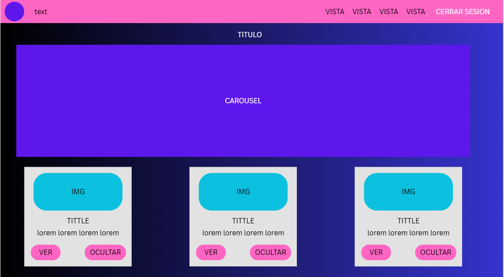
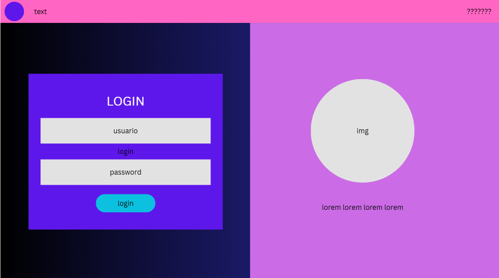
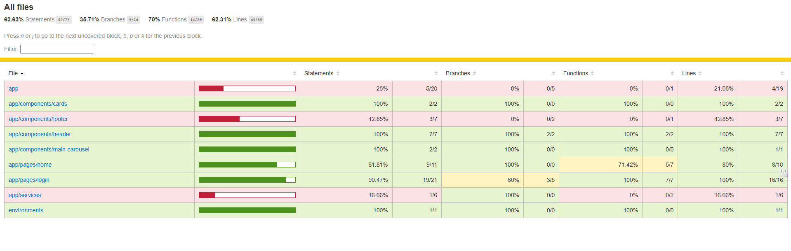

# monorepo-streaming
Streaming

# TITULO: 
Brujito movies

# DESCRIPTION: 
Plataforma de streaming

# CAPTURAS DE PANTALLA DEL PROYECTO


# MOCKUP




# DESCARGA EL REPO
1. Entra al repo: https://github.com/ADRIANMEDINALIMON/Streaming-AML  
2. Haz clic en el boton verde **Code**  
3. Selecciona **Download ZIP**  
4. Extrae el ZIP en tu carpeta de proyectos  
5. Abre una terminal y navega a la carpeta `api_streaming`  
   - Ajusta la cadena de conexión en `appsettings.json` (tu servidor SQL y credenciales)  
   - Ejecuta:
     ```
     dotnet build
     dotnet ef database update
     dotnet run
     ```
   - La API quedará disponible en `http://localhost:5162/` (Swagger UI)  
6. En otra terminal, navega a la carpeta `Streaming`  
   - Ejecuta:
     ```
     npm install
     ng serve
     ```
   - La app Angular quedará disponible en `http://localhost:4200/`  
7. Ve a tu navegador y abre `http://localhost:4200/` para probar el Login y el CRUDSITO de usuarios  

# Dependencias o bibliotecas

@angular/core    ^18.2.0
@angular/common   ^18.2.0
@angular/compiler  ^18.2.0
@angular/platform-browser ^18.2.0
@angular/platform-browser-dynamic ^18.2.0
@angular/router   ^18.2.0
@angular/forms   ^18.2.0
@angular/animations ^18.2.0
bootstrap       ^5.3.5
rxjs         ~7.8.0
zone.js       ~0.14.10
tslib        ^2.3.0
DevDependencies (“devDependencies”):
@angular/cli     ^18.2.18
@angular-devkit/build-angular ^18.2.18
@angular/compiler-cli ^18.2.0
typescript      ~5.5.2
jasmine-core    ~5.2.0
karma        ~6.4.0
karma-chrome-launcher ~3.2.0
karma-coverage   ~2.2.0
karma-jasmine   ~5.1.0
karma-jasmine-html-reporter ~2.1.0
@types/jasmine   ~5.1.0

BCrypt.Net-Next	4.0.3
Microsoft.AspNetCore.Authentication.JwtBearer	9.0.5	
Microsoft.AspNetCore.Mvc	2.3.0	
Microsoft.AspNetCore.OpenApi	9.0.5	
Microsoft.EntityFrameworkCore.SqlServer	9.0.5	
Microsoft.EntityFrameworkCore.Tools	9.0.5	
Swashbuckle.AspNetCore	8.1.2	


# DESCRIPCION

1. API en ASP.NET Core con CRUD completo de usuarios y login  
2. Documentacion completa con Swagger UI en `http://localhost:5162/`  
3. Frontend Angular que se conecta a la API, maneja login, guarda user en localStorage  
4. AuthGuard que protege rutas privadas y header dinamico  
5. Un solo repo (monorepo) con backend y frontend juntos  

# Code Coverage y reporte de testing




# DIAGRAMA DE ENTIDAD-RELACIÓN DE LA BASE DE DATOS


# MEJORAS FUTURAS

JWT
REGISTRO
BD VINCULAR PELICULAS FAVORITAS
ENCLIPTADO

# Swagger


# PROBLEMAS 
formGroup no funciona
falta importar ReactiveFormsModule en el componente standalone lo arreglé agregando ReactiveFormsModule en imports de LoginComponent o usando importProvidersFrom(ReactiveFormsModule) en app.config.ts

*router-outlet y ngIf no reconocidos
en AppComponent standalone no había importado CommonModule ni RouterOutlet los incluí bajo imports del componente para que Angular los reconozca

authguard no encontrado
no tenía el guard creado o registrado generé AuthGuard standalone con providedIn root y lo importé en app.routes.ts para proteger rutas

login devuelve error 415 o 401
en Postman olvidé enviar JSON con el header Content-Type application/json ajusté el cuerpo a JSON y confirmé que environment.API_URL coincidiera con la URL de la API

CORS bloquea peticiones desde Angular
no había configurado CORS en el backend agregué en Program.cs

# Que hice bien...
Trate de superar el coverage mas del 50%

# Que no salio bien...
Muchos errores que tuve que ir corrigiendo 

# Que puedo hacer diferente...
Mejorar mi codigo, siento que me falto organizar mejor, hacer dinamico algunos bloques de codigo y el responsive